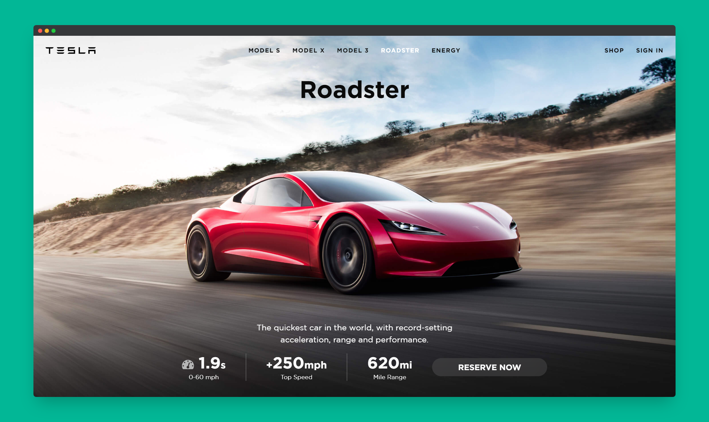

# Scrimba - Bulma Tesla Launchpage solution

This is a solution to the [Bulma Tesla Launchpage project on Scrimba](https://scrimba.com/learn/). Scrimba helps you improve your coding skills by building realistic projects.

## Table of contents

- [Overview](#overview)
  - [The challenge](#the-challenge)
  - [Screenshot](#screenshot)
  - [Links](#links)
- [My process](#my-process)
  - [Built with](#built-with)
  - [Continued development](#continued-development)
  - [Useful resources](#useful-resources)
- [Author](#author)
- [Acknowledgments](#acknowledgments)

## Overview

### The challenge

Users should be able to:

- Have a responsive launchpage
- See hover states for interactive elements

### Screenshot

### Links

- Solution URL: [@GitHub](https://github.com/xdelmo/bulma-tesla-launchpage)
- Live Site URL: [@GitHub](https://bulma-tesla-launchpage.netlify.app/)

## My process

### Built with

- Semantic HTML5 markup
- CSS framework Bulma
- CSS custom properties
- Flexbox
- CSS Grid Layout
- Mobile-first workflow
- Vanilla Javascript

### Continued development

I'd like to:

- ~~Implement responsive Navbar~~
- ~~Add loading animation~~
- Add more content to the page
- Add a Client-side form validation
- Improve design using GSAP animation

### Useful resources

- [Bulma](https://bulma.io/) - Open source CSS framework that provides ready-to-use frontend components
- [CodePen](https://codepen.io/kanishkkunal/pen/QWGzBwz) - Glassmorphism CSS Buttons
- [SiteUptime](https://www.siteuptime.com/blog/2019/04/05/6-tips-on-how-to-make-videos-load-faster-on-your-site/) - How to make videos load faster on the web
- [ConvertPoint](https://codepen.io/kanishkkunal/pen/QWGzBwz)&[CloudConvert](https://cloudconvert.com/mp4-to-webm) - To compress and convert video to WEBM
- [StackOverflow](https://stackoverflow.com/questions/67480259/excluding-a-child-element-from-being-affected-by-a-css-animation) - Excluding a child element from being affected by a CSS animation
- [StackOverflow](https://stackoverflow.com/questions/71503820/how-to-add-an-event-listener-to-all-items-in-array) - How to add an event listener to all items in array

## Author

- Website - [Emanuele Del Monte](https://www.emanueledelmonte.it)

## Acknowledgments

A big thank you to [Zaydek Gualtieri](https://twitter.com/username_zaydek)
